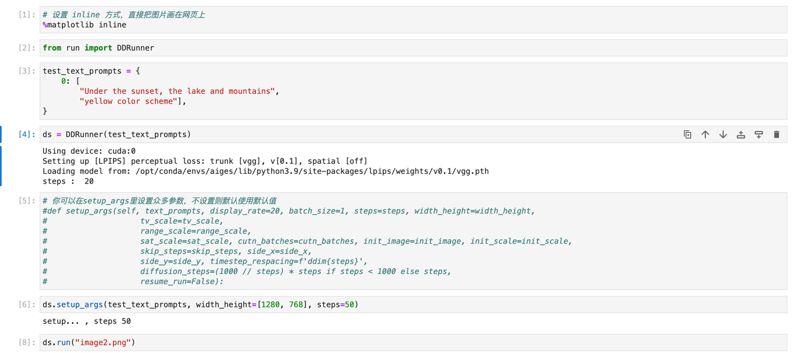
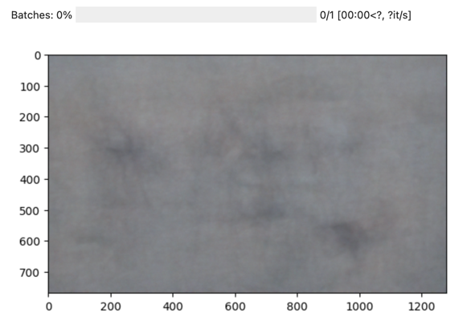
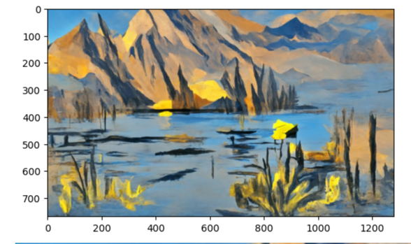

# better disco diffusion 

## background 

Thanks a lot for the work of disco diffusion, very cool...

However, the code is tough...

Although it may not have done much modification to the original code, I think it is easier to use, at least for AI engineers. The raw code may be elegant, but implementing a single function in hundreds of lines is daunting.

The current work is still not perfect, it needs you and me to iterate together, welcome your contribution

## target

make the origin dd's code more readable....

i split some implements, and using some class to wrapper the main logic...


## pull from docker hub
the image is so big which have the whole models that you don't need to download..

```
docker pull iflyopensource/disco_diffusion:v2
cd /home/aiges/disco
python run.py
```

## or you can build  docker image

```
git clone git@github.com:whybeyoung/better-disco-diffusion.git

git submodule update --init --recursive

docker build . -t dd:latest
```

## notebook

[Get started](docs/get_started.ipynb)




## contact with me


* focus on:

[](https://github.com/iflytek)

* contact:


  

